 Follow me..

<!--more-->

### 用chrome打开qq音乐的主页 https://y.qq.com/

> 搜索周杰伦的"稻香"
  
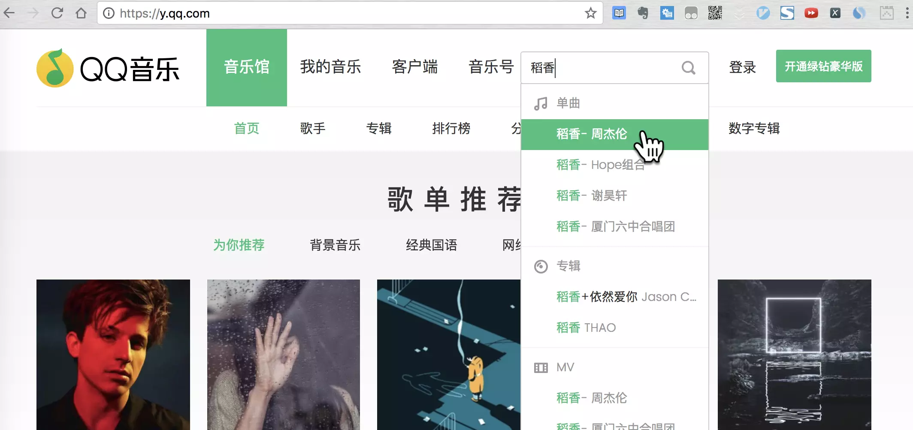

> 选择自己喜欢的歌曲版本
  
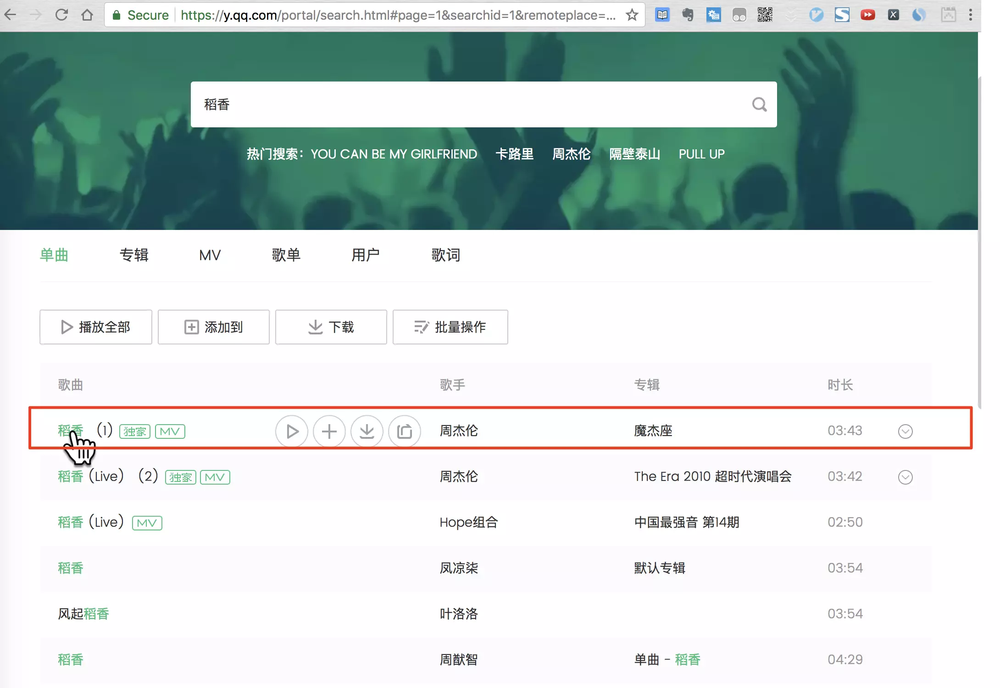

> 点击播放

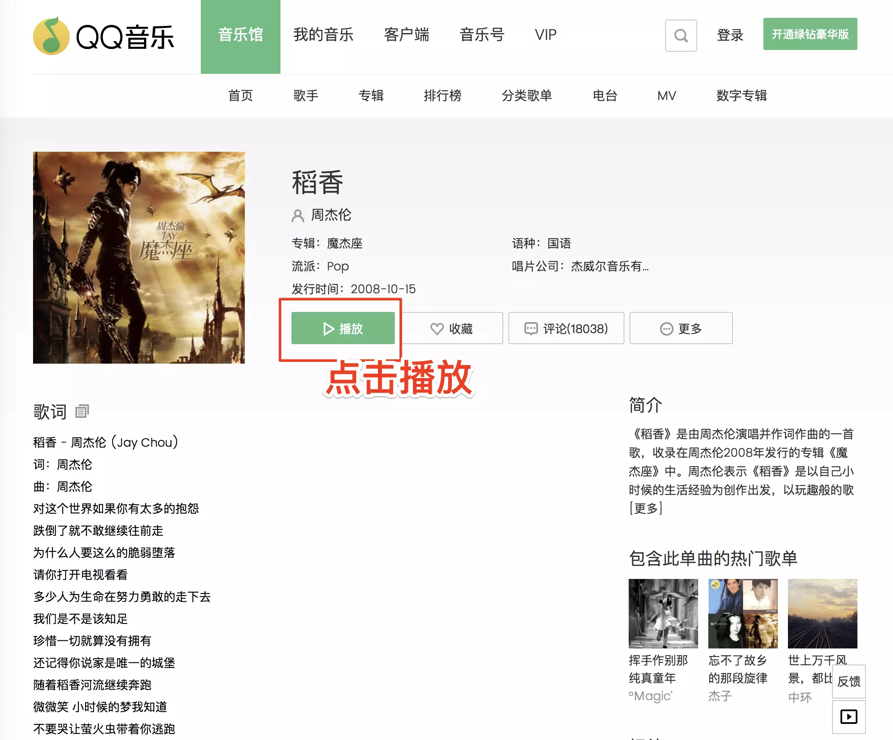

> 尝试下载, 不行!

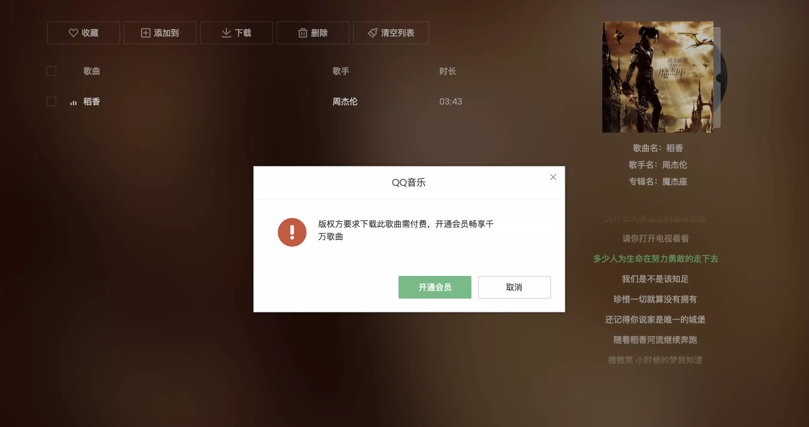

### 让我们来使用chrome开发者工具

> chrome浏览器右上角, 更多工具, 点击开发者工具

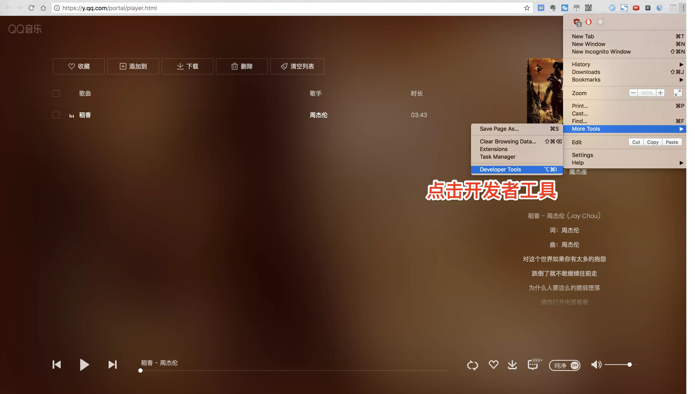

> 在开发者工具面板, 选择"Network"

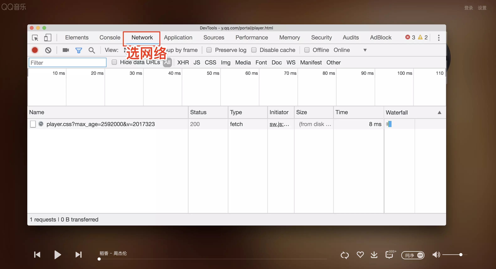

> 浏览器左上角选择刷新按钮, 右键, 彻底清理缓存

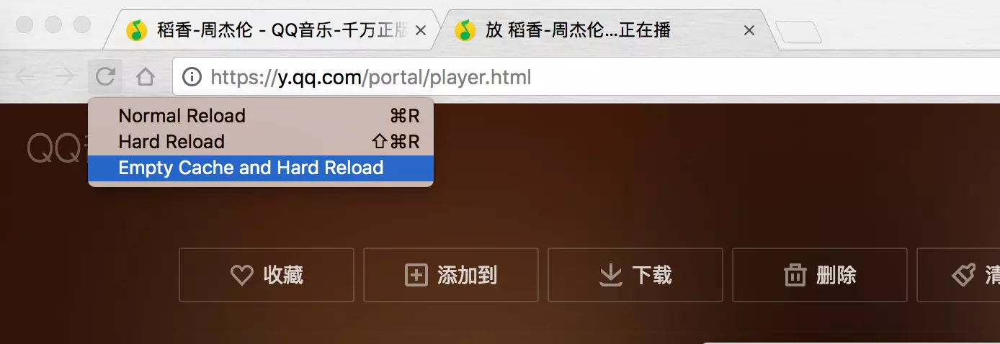

> 返回开发者工具面板, 在Network面板, 点击size, 点击两次(第一次为升序, 第二次为降序, 和淘宝的按价格排序一个套路)

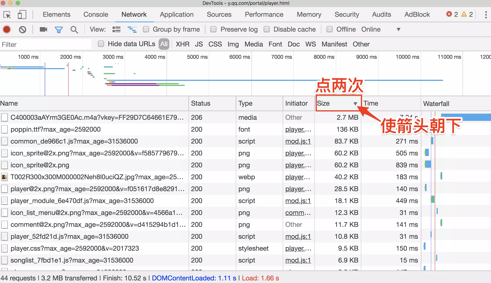

> 选择size里面最大的那个

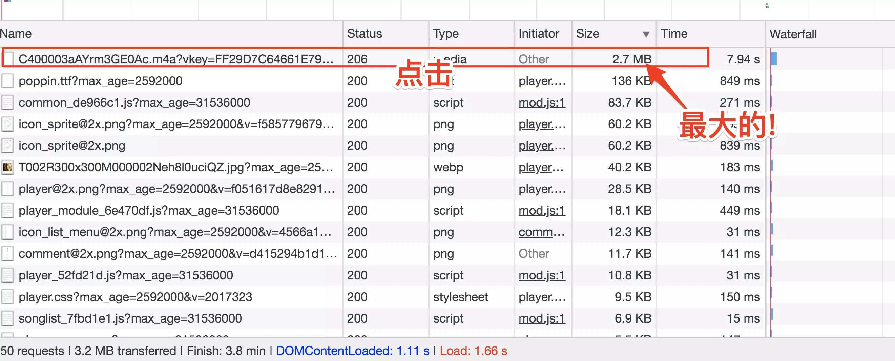

> 复制url

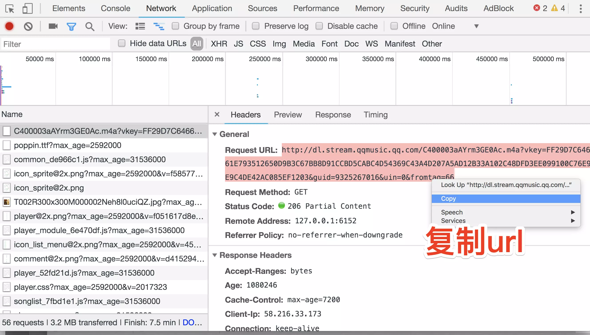

> 在新页面打开url,看到三个没，↓ ↓ ↓
  
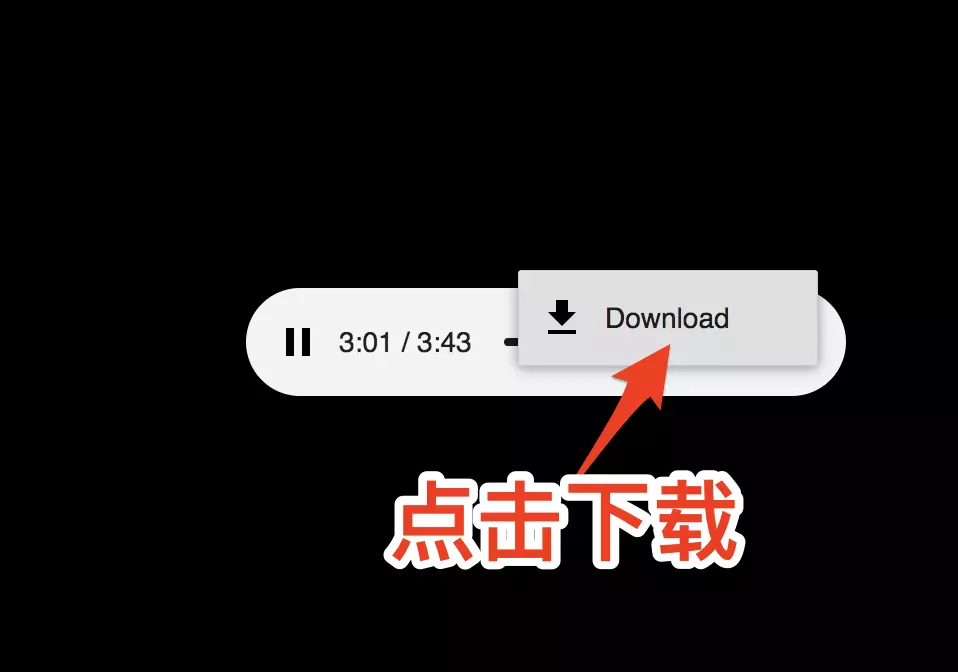

> 用音乐播放器开发，就可以听歌啦，还带歌词头像

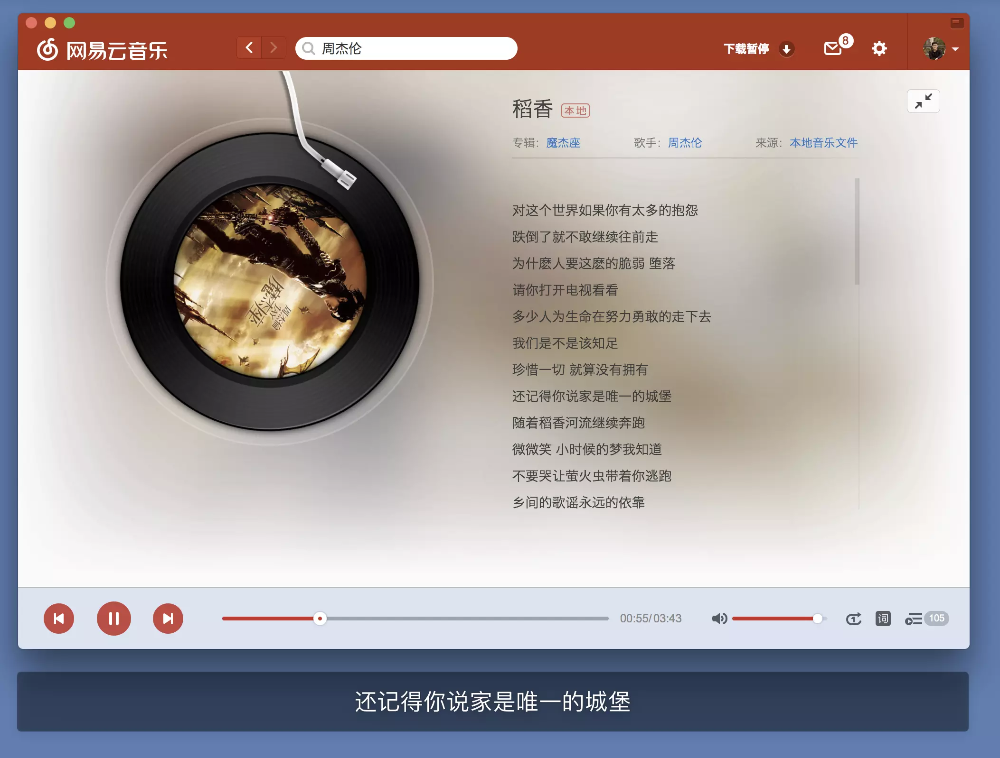

> 到这里就结束了，有没有学到呢，以后下歌就可以不能花钱啦，嘻嘻

[大佬的文章](https://www.jianshu.com/p/b6eb3162770e)