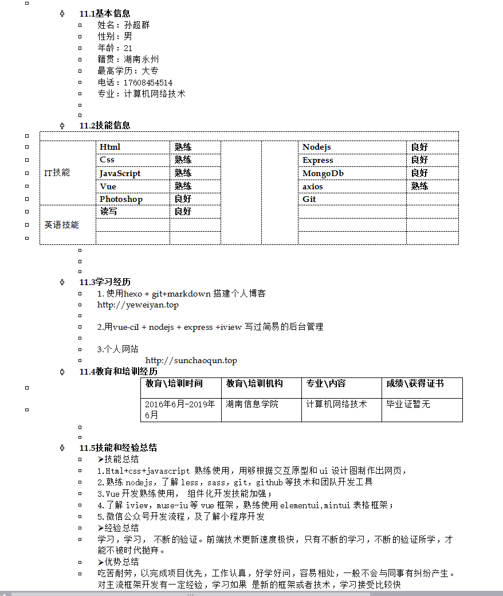

<!--more-->



> 基础

①怎样添加、移除、移动、复制、创建和查找节点？

```
createDocumentFragment  //创建新DOM片段
createElement //创建一个元素
createTextNode //创建一个文本节点
```

②添加 移除 替换 插入

```
appendChild() //添加
removeChild //移除
replaceChild //替换
insertBofore //插入
```

③查找
```
getElementsByTagName() //通过标签名查找
getElementsByName() //通过元素的name属性查找
getElementById() //通过元素的id查找
```


2.如何理解闭包
定义和用法：
一个父函数里面包含了一个子函数，子函数调用了父函数内部的变量，如果子函数在外部被调用，就产生了闭包。

简单的说：闭包就是能够读取其他函数内部变量的函数。

闭包的作用：
①读取其他函数内部的变量
②变量保存在内存中

注意：
使用过多的闭包会消耗大量内存，造成网页的性能问题，可以在函数执行完成之前把不需要的局部变量删除。

3.sessionStorge , localStorge , cookie , Web Storage之间的区别
①数据存储大小
cookie：4kb
webStorge：5mb

②数据存储有效期限
cookie：根据自己的设置时间
sessionStorage：关闭窗口后失效

localStorage：永久有效除非js删除或者浏览器删除
③作用域
cookie和localStorage是在同源窗口，同一个浏览器共享的，sessionStorage只在同一个标签页共享。

4.请指出document load和document ready的区别？
ready：页面的文档结构加载完成，不包括图片视频等非文字内容。
load：所有页面元素都加载完成
ready的速度比load快

5.网站性能优化
HTML方面：
①资源文件js css 图片合并压缩
②减少页面dom操作，操作多的话可以考虑使用虚拟dom
③减少http请求
④使用cdn加速
cdn的作用：cdn可以处理整个网站 70%-95%的访问量，从而解决网站的并发量，简单的说就是通过在不同地点缓存内容，然后通过负载平衡等技术将用户请求定向到最近的缓存服务器上获取内容，提高用户访问网站的响应速度。
⑤减少cookie大小

6.从浏览器地址栏输入url到显示页面的步骤
①浏览器根据请求的URL，交给DNS域名解析，找到真实的ip，交给域名解析。
②服务器交给后端处理完成后返回的数据，浏览器接收文件HTML,CSS,JS图片等。
③浏览器对加载的资源进行语法解析，建立相应的数据内部结构。
④解析html，创建dom树，自上而下的顺序
⑤解析css，优先级：浏览器默认设置<用户设置<外部样式<内联样式<HTML中的style样式；
⑥将css与dom合并，构建渲染树
⑦布局重绘重排，页面完成渲染。

7.常见的HTML状态码和他的含义
1XX：信息状态码
100 Continue 继续，一般在发送post请求时，已发送了http header之后服务端将返回此信息，表示确认，之后发送具体参数信息

2XX：成功状态码
200 OK 正常返回信息
201 Created 请求成功并且服务器创建了新的资源
202 Accepted 服务器已接受请求，但尚未处理

3XX：重定向
301 Moved Permanently 请求的网页已永久移动到新位置。
302 Found 临时性重定向。
303 See Other 临时性重定向，且总是使用 GET 请求新的 URI。
304 Not Modified 自从上次请求后，请求的网页未修改过。

4XX：客户端错误
400 Bad Request 服务器无法理解请求的格式，客户端不应当尝试再次使用相同的内容发起请求。
401 Unauthorized 请求未授权。
403 Forbidden 禁止访问。
404 Not Found 找不到如何与 URI 相匹配的资源。

5XX: 服务器错误
500 Internal Server Error 最常见的服务器端错误。
503 Service Unavailable 服务器端暂时无法处理请求（可能是过载或维护）。

8.对浏览器内核的理解
主要分为渲染引擎和js引擎
渲染引擎：主要负责取得网页的（html，xml，图片等），整理信息结合css渲染页面，计算网页的显示方式，浏览器内核的不同对网页的语法解释也会有所不同，所以渲染效果也会有所不同，这就存在了兼容性的问题。

js引擎：解析和执行js来达到网页的动态交互效果
最开始渲染引擎和js引擎没有太区分，后来越来越独立化，然后内核一般就是指渲染引擎了。

9.html5有哪些新特性
新增了 canvas，video，audio，nav，section，footer，header等元素。
表单控件，calendar、date、time、email、url、search
存储技术：localStorage，sessionStorage等
新的技术：webworker, websocket, Geolocation

10.iframed的缺点
①iframe会阻塞页面的 onload事件
②搜索引擎不能够解读 iframe 页面，不利于 seo
③iframe和主页面共享连接池，然而浏览器对相同域的链接是有限制的，所以这会影响页面的并行加载。
④如果想要绕开以上的2个问题，可以考虑通过js动态给 iframe添加src值。

11.web标准以及w3c标准
标签闭合，标签小写，不乱嵌套，使用外链形式的css和js，结构层，表现层，行为层分离。

12.xhtml和html有什么区别
一个是功能上的差别

主要是XHTML可兼容各大浏览器、手机以及PDA，并且浏览器也能快速正确地编译网页
另外是书写习惯的差别

XHTML 元素必须被正确地嵌套，闭合，区分大小写，文档必须拥有根元素

简单的说，xhtml更加严格。

13.Doctype作用，严格模式与混杂模式如何区分？它们有何意义?
Doctype处于文档的最前面，用来告诉浏览器的解析器，文档的类型。
严格模式的js运行和排版是按照浏览器支持的最高标准的。
混杂模式就是兼容性模式，当页面兼容不好的时候，就可以选用这种模式，防止页面布局错落无法站点工作。

14.行内元素有哪些，块级元素有哪些，空(void)元素有那些？行内元素和块级元素有什么区别？
行内元素：a b span img input select strong
块级元素：div ul li ol dl dt dd h1 h2 h3 p
空元素：br hr link meta
块级元素独占一行，行内元素合一并行一行

15.html的全局属性有哪些
class：为元素设置类标识
data-**：为元素添加自定义属性
draggable：设置元素是否可以拖曳
id：元素的id，同一个id文档内是唯一的
style：元素样式
title：鼠标上移显示信息

16.canvas和svg的区别
svg绘制出来的图片有独立dom节点，可以绑定事件，是矢量图，放大图片不会有锯齿。
canvas绘制出来的图片是一个画布，等于就是一张图，放大会产生锯齿。

17.css sprite是什么，有什么优缺点
就是将多个小图标拼接在一张图片上，减少对图片的请求，使用 background-size来定位到相关图片上。

优点：

减少HTTP请求数，极大地提高页面加载速度
增加图片信息重复度，提高压缩比，减少图片大小
更换风格方便，只需在一张或几张图片上修改颜色或样式即可实现
缺点：

图片合并麻烦
维护麻烦，修改一个图片可能需要从新布局整个图片，样式

18.display: none;与visibility: hidden;的区别
他们的作用都是让元素不可见
区别：
display：none会让元素完全从 dom 树中消失，渲染的时候不占据任何空间。
visibility：hidden不会让元素从渲染树 dom 中消失，而且还是会占据一定的空间，只是内容不可见而已。

19.link与@import的区别
1.link是html 的方式，@import是css的方式
2.link最大限度支持并行下载，@import过多嵌套导致串行下载
3.link可以通过rel="alternate stylesheet"指定候选样式
4.总体来说：link优于@import

20.清除浮动的几种方式
1.clear：both，添加一个空标签div
2.父级div定义伪类:after和zoom
3.父级div定义overflow:hidden
4.父级div也浮动，需要定义宽度
5.结尾处加br标签clear:both

我自己常用的浮动清除

```shell
.clearfix:after{visibility:hidden;display:block;font-size:0;content:" ";clear:both;height:0}
.clearfix{display:inline-table}
.clearfix{height:1%}
.clearfix{display:block;*zoom:1}

```
21.为什么要初始化css样式
因为浏览器的兼容问题，不同浏览器对有些标签的默认值是不同的，如果没对CSS初始化往往会出现浏览器之间的页面显示差异。
当然，初始化样式会对SEO有一定的影响，但鱼和熊掌不可兼得，但力求影响最小的情况下初始化

22.css3有哪些新特性
新增各种css选择器
圆角 border-radius
多列布局
阴影和反射
文字特效text-shadow
线性渐变
旋转transform
动画效果

23.介绍一下css盒子模型
有两种， IE盒子模型、W3C盒子模型；
盒模型： 内容(content)、填充(padding)、边界(margin)、 边框(border)；
区 别： IE（低版本）的content部分把 border 和 padding计算了进去;

24.css的优先级算法是怎么样的
优先级为: !important > id > class > tag
important 比 内联优先级高

25.base64的原理及优缺点
优点可以加密，减少了http请求
缺点是需要消耗CPU进行编解码

在上传图片的时候会用到

26.说说你对作用于链的理解
作用域链中的变量都是向上访问的，变量访问到windows对象后终止，向下访问是不允许的。
简单的说，作用域就是变量函数的可访问范围。

27.js原型，原型链有什么特点
每个对象在内部都是会初始化一个属性的，prototype（原型），当我们访问一个对象的属性时，如果这个对象不存在这个属性，那么他就会去 prototype中查找，然后 prototype中还有自己的 prototype，就这样一直找下去，这就是原型链的概念。

28.什么是事件代理，事件委托
假如我们有一个 ul 列表，里面有4个li，我们可以在 li 上绑定 click 事件，但是也可以在她们的 父节点 ul上绑定，这种在 父节点上绑定事件来代替子节点事件的方法，就叫做事件委托。

29.对this的理解
this总是指向函数的直接调用者（而非间接调用者）
如果有new关键字，this指向new出来的那个对象
在事件中，this指向触发这个事件的对象，特殊的是，IE中的attachEvent中的this总是指向全局对象Window

30.事件模型是什么
w3c中定义的事件发生的过程的3个阶段：
捕获阶段（capturing）、目标阶段（targetin）、冒泡阶段（bubbling）

31.ajax的优缺点
优点：
通过异步模式，提升了用户体验.
优化了浏览器和服务器之间的传输，减少不必要的数据往返，减少了带宽占用.
Ajax在客户端运行，承担了一部分本来由服务器承担的工作，减少了大用户量下的服务器负载。
Ajax可以实现动态不刷新（局部刷新）

缺点：
安全问题 AJAX暴露了与服务器交互的细节。
对搜索引擎的支持比较弱。
不容易调试。

32.怎么解决跨域问题
jsonp、 iframe、window.name、window.postMessage、服务器上设置代理页面
一般由后台设置允许跨域

33.哪些操作会造成内存泄漏
内存泄漏是指 一些对象我们不在使用它的时候，他任然存在
setTimeout 的第一个参数使用字符串而非函数的话，会引发内存泄漏
闭包使用不当

34.vue、react、angular
Vue.js
一个用于创建 web 交互界面的库，是一个精简的 MVVM。它通过双向数据绑定把 View 层和 Model 层连接了起来。实际的 DOM 封装和输出格式都被抽象为了Directives 和 Filters

AngularJS
是一个比较完善的前端MVVM框架，包含模板，数据双向绑定，路由，模块化，服务，依赖注入等所有功能，模板功能强大丰富，自带了丰富的 Angular指令

react
React 仅仅是 VIEW 层是facebook公司。推出的一个用于构建UI的一个库，能够实现服务器端的渲染。用了virtual dom，所以性能很好。

35.eval是做什么的
它的功能是把对应的字符串解析成JS代码并运行
应该避免使用eval，不安全，非常耗性能（2次，一次解析成js语句，一次执行）
由JSON字符串转换为JSON对象的时候可以用eval，var obj =eval('('+ str +')')

36.null和undefine的区别
undefine:
表示不存在这个值，如果变量被声明了没有赋值
null：
变量被定义赋值了，但是为空的情况，没有任何属性方法和值
在验证null时，一定要使用　=== ，因为 ==无法分别null 和　undefined

37.对json的了解
是一种轻量级的数据交换格式
数据格式简单，易于读写

JSON字符串转换为JSON对象:
```
var obj =eval('('+ str +')');
var obj = str.parseJSON();
var obj = JSON.parse(str);
```

JSON对象转换为json字符串

```
var last=obj.toJSONString();
var last=JSON.stringify(obj);
```

38.同步和异步的区别
同步：浏览器访问服务器请求，用户看得到页面刷新，重新发请求,等请求完，页面刷新，新内容出现，用户看到新内容,进行下一步操作
异步：浏览器访问服务器请求，用户正常操作，浏览器后端进行请求。等请求完，页面不刷新，新内容也会出现，用户看到新内容

39.渐进增强和优雅降级
渐进增强 ：针对低版本浏览器进行构建页面，保证最基本的功能，然后再针对高级浏览器进行效果、交互等改进和追加功能达到更好的用户体验。
优雅降级 ：一开始就构建完整的功能，然后再针对低版本浏览器进行兼容

40.attribute和property的区别是什么？
attribute是dom元素在文档中作为html标签拥有的属性；
property就是dom元素在js中作为对象拥有的属性。

41.谈谈对ES6的理解
新增了 字符串模板/箭头函数/for of（遍历对象中的值）/增加了块级作用域

42.什么是面向对象的编程和面向过程的编程，他们的异同和优缺点
面向过程就是对一个问题提出解决思路，然后一步步的列出函数解决，依次调用。
面向对象就是将构成问题分解成各个对象，建立对象的目的不是为了完成一个步骤，而是为了描叙某个事物在整个解决问题的步骤中的行为。
面向对象是以功能来划分问题，而不是步骤

43.面向对象的编程思想
基本思想是使用封装，类，对象的方法进行程序设计
优点：
容易维护
易扩展
开发工作的重用性、继承性高，降低重复工作量。
缩短了开发周期

44.函数式编程
它具有以下特性：闭包和高阶函数、惰性计算、递归、函数是"第一等公民"、只用"表达式"

45.箭头函数与普通函数的区别
this的指向不通


來源：https://www.jianshu.com/p/063cd18a02ad